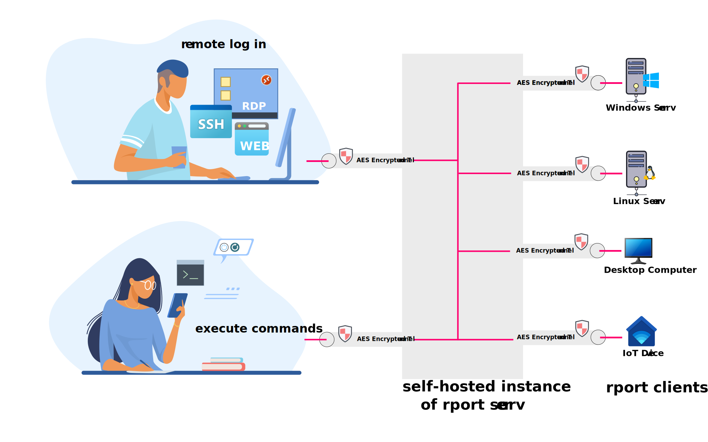

## At a glance
Rport helps you to manage your remote servers without the hassle of VPNs, chained SSH connections, jump-hosts, or the use of commercial tools like TeamViewer and its clones.

Rport acts as server and client establishing permanent or on-demand secure tunnels to devices inside protected intranets behind a firewall.

All operating systems provide secure and well-established mechanisms for remote management, being SSH and Remote Desktop the most widely used. Rport makes them accessible easily and securely.

    <iframe src="https://player.vimeo.com/video/530717168?byline=0&portrait=0" width="640" height="360" allow="autoplay; fullscreen; picture-in-picture" allowfullscreen></iframe>

Watch our short [explainer video](https://vimeo.com/530717168).

**Is Rport a replacement for TeamViewer?**
Yes and no. It depends on your needs.
TeamViewer and a couple of similar products are focused on giving access to a remote graphical desktop bypassing the Remote Desktop implementation of Microsoft. They fall short in a heterogeneous environment where access to headless Linux machines is needed. But they are without alternatives for Windows Home Editions.
Apart from remote management, they offer supplementary services like Video Conferences, desktop sharing, screen mirroring, or spontaneous remote assistance for desktop users.

**Goal of Rport**
Rport focuses only on remote management of those operating systems where an existing login mechanism can be used. It can be used for Linux and Windows, but also appliances and IoT devices providing a web-based configuration.
From a technological perspective, [Ngrok](https://ngrok.com/) and [openport.io](https://openport.io) are similar products. Rport differs from them in many aspects.
* Rport is 100% open source. Client and Server. Remote management is a matter of trust and security. Rport is fully transparent.
* Rport will come with a user interface making the management of remote systems easy and user-friendly.
* Rport is made for all operating systems with native and small binaries. No need for Python or similar heavyweights.
* Rport allows you to self-host the server.
* Rport allows clients to wait in standby mode without an active tunnel. Tunnels can be requested on-demand by the user remotely.

**Supported operating systems**
For the client almost all operating systems are supported and we provide binaries for a variety of Linux architectures and Microsoft Windows.
Also, the server can run on any operation system supported by the golang compiler. At the moment we provide server binaries only for Linux X64 because this is the ideal platform for running it securely and cost effective.

## Versioning model
rport uses `<major>.<minor>.<buildnumber>` version pattern for compatibility with a maximum number of package managers.

Starting from version 1.0.0 packages with even `<minor>` number are considered stable.

## Feedback and Help
**We need your feedback**.
Our vision is to establish Rport as a serious alternative to all the black box software for remote management. To make it a success, please share your feedback.
### Report bugs
If you encounter errors while installing or using Rport, please let us know. [File an issue report](https://github.com/cloudradar-monitoring/rport/issues) here on Github.
### Ask question
If you have difficulties installing or using rport, don't hesitate to ask us anything. Often questions give us a hint on how to improve the documentation. Do not use issue reports for asking questions. Use the [discussion forum](https://github.com/cloudradar-monitoring/rport/discussions) instead.
### Positive Feedback
Please share positive feedback also. Give us a star. Write a review. Share our project page on your social media. Contribute to the [discussion](https://github.com/cloudradar-monitoring/rport/discussions). Is Rport suitable for your needs? What is missing?

## Credits
* Forked from [jpillora/chisel](https://github.com/jpillora/chisel)
* Image by [pch.vector / Freepik](http://www.freepik.com)
